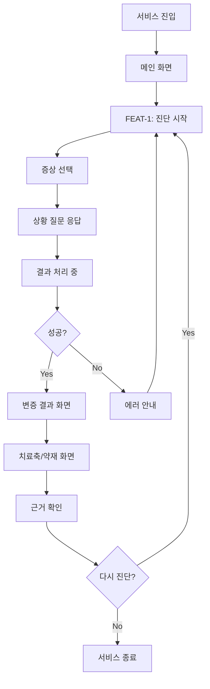
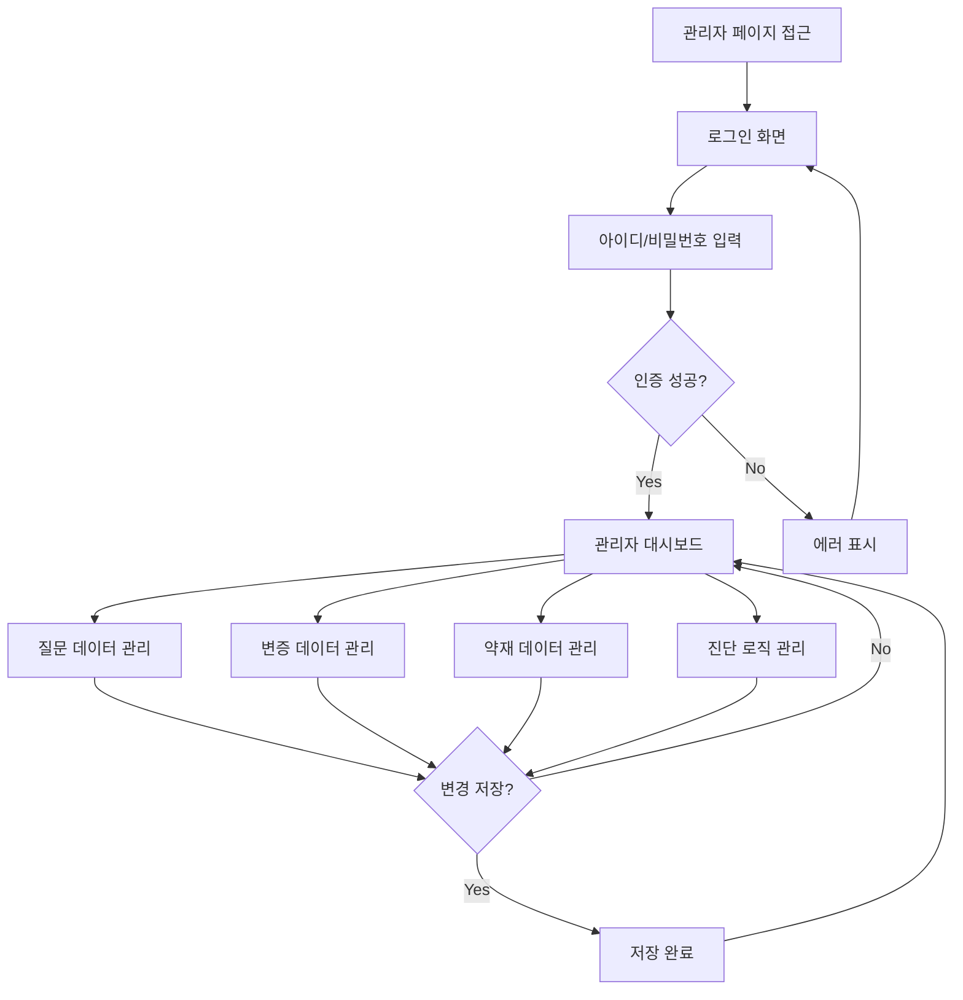
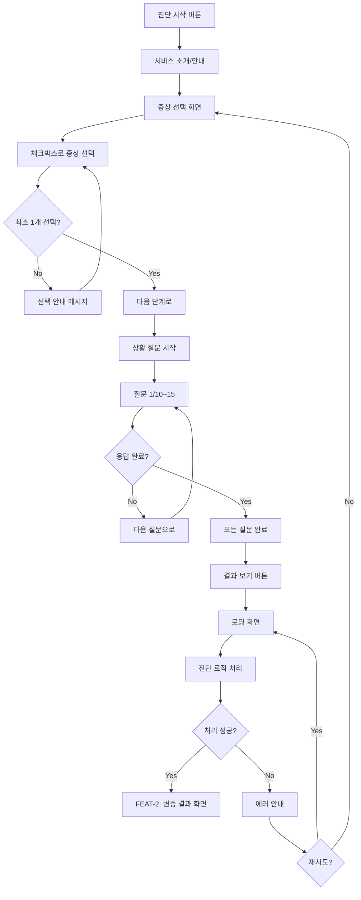
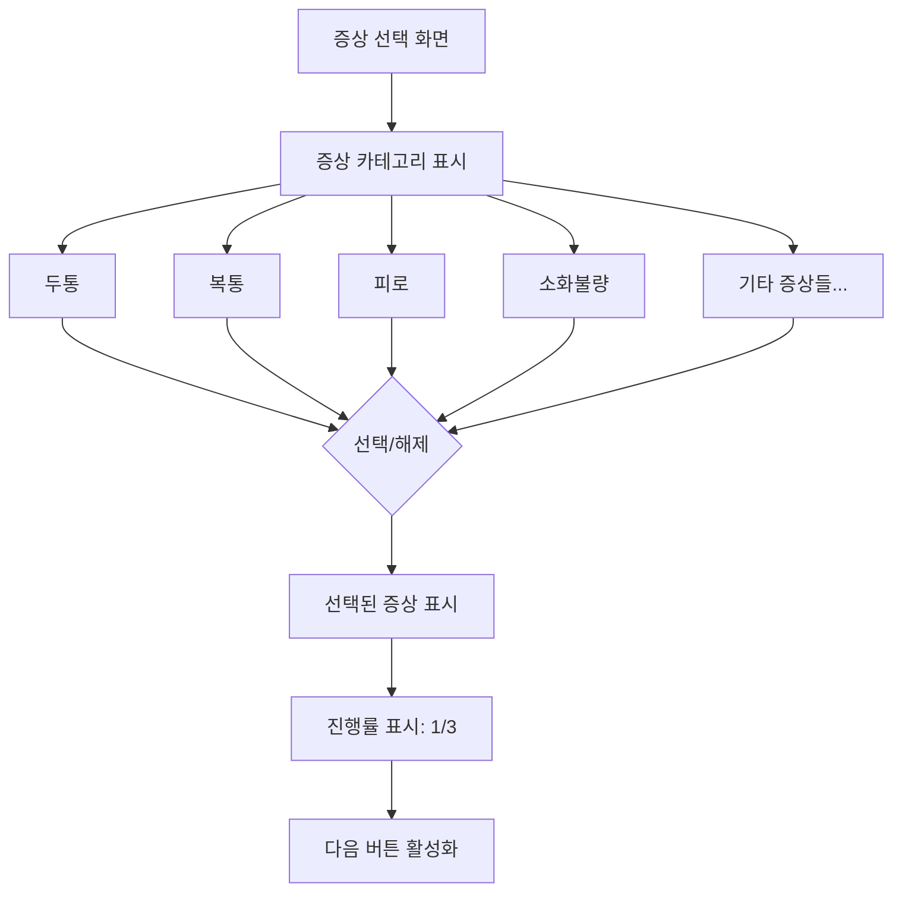
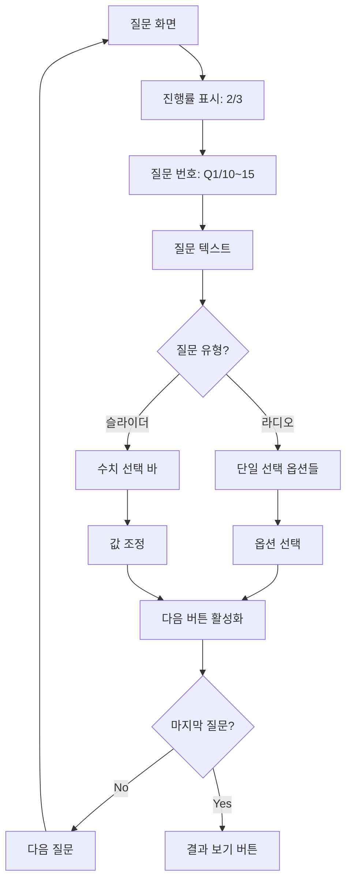
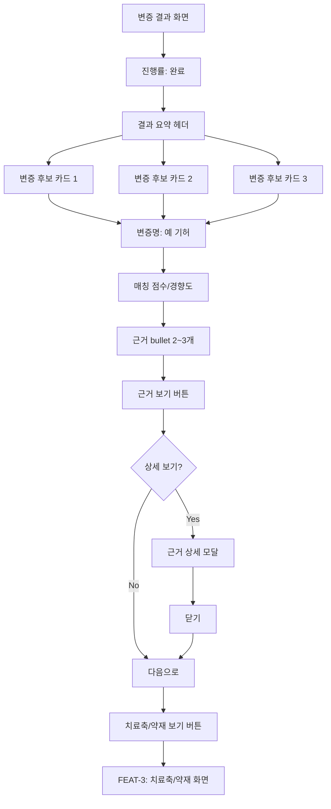
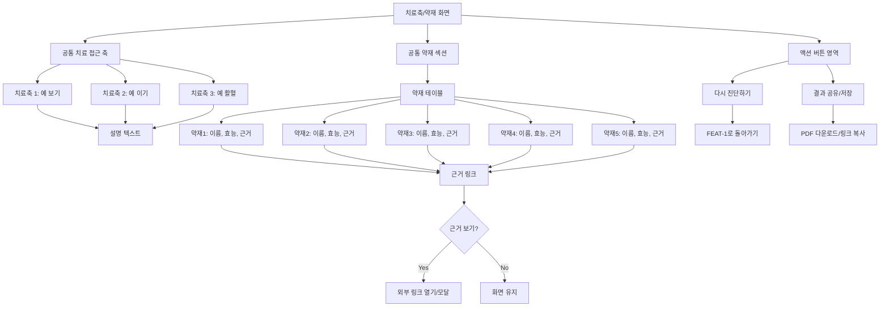
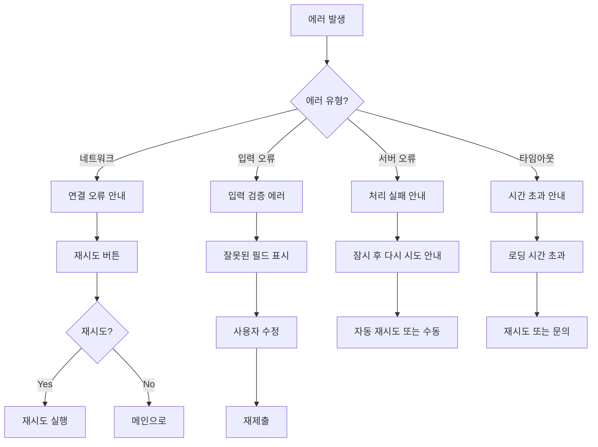

# User Flow (사용자 흐름도)

> Mermaid 플로우차트로 핵심 기능의 주요 여정을 표현합니다.
> 성공/실패 분기를 포함하고, 진단 시작 → 결과 확인 플로우를 표현합니다.

---

## MVP 캡슐

| # | 항목 | 내용 |
|---|------|------|
| 1 | 목표 | 사용자 증상 입력 → 한의학적 변증 도출 → 치료법/약재 정보 제공 |
| 2 | 페르소나 | 건강에 관심 있는 30-50대 일반인 |
| 3 | 핵심 기능 | FEAT-1: 증상 진단 설문 → 변증 결과 → 치료축/약재 추천 |
| 4 | 성공 지표 (노스스타) | 진단 완료율 (설문 시작 → 결과 확인까지 완료한 비율) |
| 5 | 입력 지표 | 일일 진단 시작 수, 결과 페이지 체류 시간 |
| 6 | 비기능 요구 | 진단 결과 산출 3초 이내, 관리자 인증 보안 |
| 7 | Out-of-scope | 모바일 앱, 소셜 로그인, 결제 시스템 |
| 8 | Top 리스크 | 진단 로직/데이터가 클라이언트로부터 늦게 전달될 경우 |
| 9 | 완화/실험 | 샘플 데이터로 먼저 개발, 로직 인터페이스 추상화 |
| 10 | 다음 단계 | 샘플 질문/변증/약재 데이터로 프로토타입 구현 |

---

## 1. 전체 사용자 여정 (Overview)



---

## 2. FEAT-0: 관리자 로그인 플로우

> 일반 사용자는 로그인 없이 진단 서비스 이용 가능
> 관리자만 로그인하여 데이터 관리



---

## 3. FEAT-1: 증상 진단 설문 플로우 (MVP 핵심)



### 3.1 증상 선택 상세



### 3.2 상황 질문 상세



---

## 4. FEAT-2: 변증 결과 화면 플로우



---

## 5. FEAT-3: 치료축/약재 추천 화면 플로우



---

## 6. 에러 처리 플로우



---

## 7. 화면 목록 (Screen Inventory)

### 7.1 사용자 화면

| 화면 ID | 화면명 | FEAT | 진입점 | 주요 액션 |
|---------|--------|------|--------|----------|
| S-01 | 메인/랜딩 | - | URL 접속 | 진단 시작 |
| S-02 | 서비스 소개 | FEAT-1 | S-01 | 다음으로 |
| S-03 | 증상 선택 | FEAT-1 | S-02 | 체크박스 선택, 다음 |
| S-04 | 상황 질문 | FEAT-1 | S-03 | 라디오/슬라이더 응답 |
| S-05 | 로딩 | FEAT-1 | S-04 | 대기 |
| S-06 | 변증 결과 | FEAT-2 | S-05 | 카드 확인, 근거 보기 |
| S-07 | 치료축/약재 | FEAT-3 | S-06 | 테이블 확인, 근거 링크 |
| S-08 | 에러 | - | 모든 화면 | 재시도, 돌아가기 |

### 7.2 관리자 화면

| 화면 ID | 화면명 | FEAT | 진입점 | 주요 액션 |
|---------|--------|------|--------|----------|
| A-01 | 관리자 로그인 | FEAT-0 | /admin URL | 로그인 |
| A-02 | 대시보드 | FEAT-0 | A-01 | 메뉴 선택 |
| A-03 | 증상 관리 | FEAT-0 | A-02 | CRUD |
| A-04 | 질문 관리 | FEAT-0 | A-02 | CRUD |
| A-05 | 변증 관리 | FEAT-0 | A-02 | CRUD |
| A-06 | 약재 관리 | FEAT-0 | A-02 | CRUD |
| A-07 | 로직 관리 | FEAT-0 | A-02 | 수정, 저장 |

---

## 8. 화면 전환 매트릭스

| From \ To | S-01 | S-02 | S-03 | S-04 | S-05 | S-06 | S-07 |
|-----------|------|------|------|------|------|------|------|
| S-01 | - | O | - | - | - | - | - |
| S-02 | O | - | O | - | - | - | - |
| S-03 | O | O | - | O | - | - | - |
| S-04 | O | - | O | - | O | - | - |
| S-05 | - | - | - | - | - | O | - |
| S-06 | O | - | - | - | - | - | O |
| S-07 | O | - | - | - | - | O | - |

---

## 9. 핵심 사용자 시나리오

### 시나리오 1: 첫 방문 진단 완료

```
1. 사용자가 메인 페이지 접속 (S-01)
2. "진단 시작" 버튼 클릭 → 서비스 소개 (S-02)
3. "시작하기" 클릭 → 증상 선택 (S-03)
4. 두통, 피로 선택 → "다음" 클릭
5. 상황 질문 응답 시작 (S-04)
6. 10개 질문에 순차적으로 응답
7. "결과 보기" 클릭 → 로딩 (S-05)
8. 변증 결과 확인: "기허", "담음", "어혈" (S-06)
9. 근거 확인 후 "치료 방법 보기" 클릭
10. 치료축 3개 + 약재 5개 확인 (S-07)
11. 근거 문헌 링크 클릭으로 신뢰도 확인
```

### 시나리오 2: 재진단

```
1. 치료축/약재 화면에서 "다시 진단" 클릭
2. 메인 또는 증상 선택 화면으로 이동
3. 새로운 증상 선택하여 진단 반복
```

### 시나리오 3: 관리자 데이터 수정

```
1. /admin 접속 → 로그인 (A-01)
2. 대시보드에서 "질문 관리" 선택 (A-02)
3. 질문 목록에서 수정할 항목 선택 (A-04)
4. 질문 텍스트 수정 후 "저장"
5. 변경 완료 확인
```

---

## Decision Log 참조

| ID | 항목 | 선택 | 근거 | 영향 |
|----|------|------|------|------|
| D-12 | 사용자 로그인 | 없음 (비회원) | MVP 단순화, 진입 장벽 최소화 | 개인정보 저장 안함 |
| D-13 | 질문 수 | 10~15개 | 안티패턴 "질문 많으면 안됨" 반영 | 완료율 향상 기대 |
| D-14 | 결과 화면 구조 | 2단계 (변증 → 약재) | 정보 과부하 방지, 단계적 노출 | 화면 분리 |
| D-15 | 진행률 표시 | 필수 | 이탈 방지, 완료 동기 부여 | 모든 단계에 표시 |
