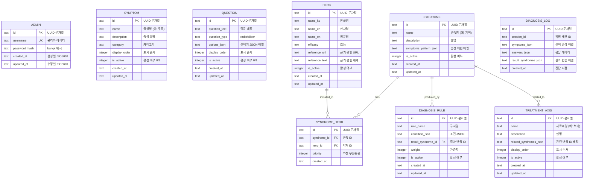

# Database Design (데이터베이스 설계)

> Mermaid ERD로 주요 엔티티와 관계를 표현합니다.
> 각 엔티티에 FEAT 주석을 달아 어떤 기능에서 사용되는지 명시합니다.
> Cloudflare D1 (SQLite) 기반으로 설계합니다.

---

## MVP 캡슐

| # | 항목 | 내용 |
|---|------|------|
| 1 | 목표 | 사용자 증상 입력 → 한의학적 변증 도출 → 치료법/약재 정보 제공 |
| 2 | 페르소나 | 건강에 관심 있는 30-50대 일반인 |
| 3 | 핵심 기능 | FEAT-1: 증상 진단 설문 → 변증 결과 → 치료축/약재 추천 |
| 4 | 성공 지표 (노스스타) | 진단 완료율 (설문 시작 → 결과 확인까지 완료한 비율) |
| 5 | 입력 지표 | 일일 진단 시작 수, 결과 페이지 체류 시간 |
| 6 | 비기능 요구 | 진단 결과 산출 3초 이내, 관리자 인증 보안 |
| 7 | Out-of-scope | 모바일 앱, 소셜 로그인, 결제 시스템 |
| 8 | Top 리스크 | 진단 로직/데이터가 클라이언트로부터 늦게 전달될 경우 |
| 9 | 완화/실험 | 샘플 데이터로 먼저 개발, 로직 인터페이스 추상화 |
| 10 | 다음 단계 | 샘플 질문/변증/약재 데이터로 프로토타입 구현 |

---

## 1. ERD (Entity Relationship Diagram)



---

## 2. 엔티티 상세 정의

### 2.1 ADMIN (관리자) - FEAT-0

| 컬럼 | 타입 | 제약조건 | 설명 |
|------|------|----------|------|
| id | TEXT | PK | UUID 문자열 |
| username | TEXT | UNIQUE, NOT NULL | 관리자 아이디 |
| password_hash | TEXT | NOT NULL | bcrypt 해시 비밀번호 |
| created_at | TEXT | NOT NULL | ISO8601 형식 생성일 |
| updated_at | TEXT | NOT NULL | ISO8601 형식 수정일 |

**인덱스:**
- `idx_admin_username` ON username

### 2.2 SYMPTOM (증상) - FEAT-1

| 컬럼 | 타입 | 제약조건 | 설명 |
|------|------|----------|------|
| id | TEXT | PK | UUID 문자열 |
| name | TEXT | NOT NULL | 증상명 (예: 두통, 복통) |
| description | TEXT | NULL | 증상 상세 설명 |
| category | TEXT | NULL | 분류 (예: 두부, 소화기) |
| display_order | INTEGER | NOT NULL, DEFAULT 0 | 화면 표시 순서 |
| is_active | INTEGER | NOT NULL, DEFAULT 1 | 0: 비활성, 1: 활성 |
| created_at | TEXT | NOT NULL | 생성일 |
| updated_at | TEXT | NOT NULL | 수정일 |

**인덱스:**
- `idx_symptom_active_order` ON (is_active, display_order)

### 2.3 QUESTION (설문 질문) - FEAT-1

| 컬럼 | 타입 | 제약조건 | 설명 |
|------|------|----------|------|
| id | TEXT | PK | UUID 문자열 |
| question_text | TEXT | NOT NULL | 질문 내용 |
| question_type | TEXT | NOT NULL | 'radio' 또는 'slider' |
| options_json | TEXT | NOT NULL | 선택지 JSON 배열 |
| display_order | INTEGER | NOT NULL, DEFAULT 0 | 표시 순서 |
| is_active | INTEGER | NOT NULL, DEFAULT 1 | 활성 여부 |
| created_at | TEXT | NOT NULL | 생성일 |
| updated_at | TEXT | NOT NULL | 수정일 |

**options_json 예시 (radio):**
```json
[
  {"value": 1, "label": "거의 없다"},
  {"value": 2, "label": "가끔"},
  {"value": 3, "label": "자주"},
  {"value": 4, "label": "항상"}
]
```

**options_json 예시 (slider):**
```json
{
  "min": 0,
  "max": 10,
  "step": 1,
  "labels": {"0": "전혀 아님", "10": "매우 심함"}
}
```

**인덱스:**
- `idx_question_active_order` ON (is_active, display_order)

### 2.4 SYNDROME (변증) - FEAT-2

| 컬럼 | 타입 | 제약조건 | 설명 |
|------|------|----------|------|
| id | TEXT | PK | UUID 문자열 |
| name | TEXT | NOT NULL | 변증명 (예: 기허, 담음) |
| description | TEXT | NULL | 변증 설명 (쉬운 말로) |
| symptoms_pattern_json | TEXT | NULL | 관련 증상 패턴 매핑 |
| is_active | INTEGER | NOT NULL, DEFAULT 1 | 활성 여부 |
| created_at | TEXT | NOT NULL | 생성일 |
| updated_at | TEXT | NOT NULL | 수정일 |

**symptoms_pattern_json 예시:**
```json
{
  "primary_symptoms": ["symptom-id-1", "symptom-id-2"],
  "secondary_symptoms": ["symptom-id-3"],
  "question_patterns": [
    {"question_id": "q1", "value_range": [3, 4]},
    {"question_id": "q2", "value_range": [2, 4]}
  ]
}
```

### 2.5 TREATMENT_AXIS (치료축) - FEAT-3

| 컬럼 | 타입 | 제약조건 | 설명 |
|------|------|----------|------|
| id | TEXT | PK | UUID 문자열 |
| name | TEXT | NOT NULL | 치료축명 (예: 보기, 이기) |
| description | TEXT | NULL | 치료 접근 설명 |
| related_syndromes_json | TEXT | NULL | 관련 변증 ID 배열 |
| display_order | INTEGER | NOT NULL, DEFAULT 0 | 표시 순서 |
| is_active | INTEGER | NOT NULL, DEFAULT 1 | 활성 여부 |
| created_at | TEXT | NOT NULL | 생성일 |
| updated_at | TEXT | NOT NULL | 수정일 |

### 2.6 HERB (약재) - FEAT-3

| 컬럼 | 타입 | 제약조건 | 설명 |
|------|------|----------|------|
| id | TEXT | PK | UUID 문자열 |
| name_ko | TEXT | NOT NULL | 한글명 |
| name_cn | TEXT | NULL | 한자명 |
| name_en | TEXT | NULL | 영문명 |
| efficacy | TEXT | NULL | 효능 설명 |
| reference_url | TEXT | NULL | 근거 문헌 URL |
| reference_text | TEXT | NULL | 근거 문헌 제목 |
| is_active | INTEGER | NOT NULL, DEFAULT 1 | 활성 여부 |
| created_at | TEXT | NOT NULL | 생성일 |
| updated_at | TEXT | NOT NULL | 수정일 |

**인덱스:**
- `idx_herb_name_ko` ON name_ko

### 2.7 SYNDROME_HERB (변증-약재 매핑) - FEAT-3

| 컬럼 | 타입 | 제약조건 | 설명 |
|------|------|----------|------|
| id | TEXT | PK | UUID 문자열 |
| syndrome_id | TEXT | FK → SYNDROME.id, NOT NULL | 변증 ID |
| herb_id | TEXT | FK → HERB.id, NOT NULL | 약재 ID |
| priority | INTEGER | NOT NULL, DEFAULT 0 | 추천 우선순위 (높을수록 우선) |
| created_at | TEXT | NOT NULL | 생성일 |

**인덱스:**
- `idx_syndrome_herb_syndrome` ON syndrome_id
- `idx_syndrome_herb_priority` ON (syndrome_id, priority DESC)
- UNIQUE ON (syndrome_id, herb_id)

### 2.8 DIAGNOSIS_RULE (진단 규칙) - FEAT-1,2

| 컬럼 | 타입 | 제약조건 | 설명 |
|------|------|----------|------|
| id | TEXT | PK | UUID 문자열 |
| rule_name | TEXT | NOT NULL | 규칙명 |
| condition_json | TEXT | NOT NULL | 조건 JSON |
| result_syndrome_id | TEXT | FK → SYNDROME.id | 결과 변증 ID |
| weight | INTEGER | NOT NULL, DEFAULT 1 | 가중치 |
| is_active | INTEGER | NOT NULL, DEFAULT 1 | 활성 여부 |
| created_at | TEXT | NOT NULL | 생성일 |
| updated_at | TEXT | NOT NULL | 수정일 |

**condition_json 예시:**
```json
{
  "type": "AND",
  "conditions": [
    {"symptom_id": "s1", "required": true},
    {"question_id": "q1", "operator": ">=", "value": 3}
  ]
}
```

### 2.9 DIAGNOSIS_LOG (진단 로그) - 분석용

| 컬럼 | 타입 | 제약조건 | 설명 |
|------|------|----------|------|
| id | TEXT | PK | UUID 문자열 |
| session_id | TEXT | NOT NULL | 익명 세션 식별자 |
| symptoms_json | TEXT | NOT NULL | 선택한 증상 ID 배열 |
| answers_json | TEXT | NOT NULL | 질문 응답 데이터 |
| result_syndromes_json | TEXT | NOT NULL | 결과 변증 배열 |
| created_at | TEXT | NOT NULL | 진단 시점 |

**인덱스:**
- `idx_log_created` ON created_at DESC

---

## 3. 관계 정의

| 부모 | 자식 | 관계 | 설명 |
|------|------|------|------|
| SYNDROME | SYNDROME_HERB | 1:N | 변증은 여러 약재와 매핑 |
| HERB | SYNDROME_HERB | 1:N | 약재는 여러 변증에 포함 |
| SYNDROME | DIAGNOSIS_RULE | 1:N | 변증은 여러 규칙의 결과 |

---

## 4. 데이터 생명주기

| 엔티티 | 생성 시점 | 보존 기간 | 삭제/익명화 |
|--------|----------|----------|------------|
| ADMIN | 서비스 초기 설정 | 영구 | 수동 삭제 |
| SYMPTOM | 관리자 등록 | 영구 | Soft delete (is_active=0) |
| QUESTION | 관리자 등록 | 영구 | Soft delete |
| SYNDROME | 관리자 등록 | 영구 | Soft delete |
| TREATMENT_AXIS | 관리자 등록 | 영구 | Soft delete |
| HERB | 관리자 등록 | 영구 | Soft delete |
| SYNDROME_HERB | 관리자 매핑 | 영구 | Hard delete |
| DIAGNOSIS_RULE | 관리자 등록 | 영구 | Soft delete |
| DIAGNOSIS_LOG | 진단 완료 시 | 30일 | Hard delete |

---

## 5. 샘플 데이터 (개발/테스트용)

### 5.1 증상 샘플

```sql
INSERT INTO symptom (id, name, description, category, display_order, is_active) VALUES
('s001', '두통', '머리가 아픈 증상', '두부', 1, 1),
('s002', '피로', '쉽게 지치고 기운이 없음', '전신', 2, 1),
('s003', '소화불량', '음식이 잘 소화되지 않음', '소화기', 3, 1),
('s004', '불면', '잠들기 어렵거나 자주 깸', '신경', 4, 1),
('s005', '복통', '배가 아픈 증상', '소화기', 5, 1);
```

### 5.2 질문 샘플

```sql
INSERT INTO question (id, question_text, question_type, options_json, display_order, is_active) VALUES
('q001', '평소 피로감을 느끼는 정도는?', 'radio', '[{"value":1,"label":"거의 없다"},{"value":2,"label":"가끔"},{"value":3,"label":"자주"},{"value":4,"label":"항상"}]', 1, 1),
('q002', '식욕은 어떤 편인가요?', 'radio', '[{"value":1,"label":"매우 좋음"},{"value":2,"label":"보통"},{"value":3,"label":"없는 편"},{"value":4,"label":"전혀 없음"}]', 2, 1);
```

### 5.3 변증 샘플

```sql
INSERT INTO syndrome (id, name, description, is_active) VALUES
('syn001', '기허', '기(氣)가 부족한 상태. 피로, 무기력, 땀이 잘 남', 1),
('syn002', '담음', '체내에 비정상적인 수분이 정체된 상태', 1),
('syn003', '어혈', '혈액 순환이 원활하지 않은 상태', 1);
```

---

## 6. Drizzle ORM 스키마 예시

```typescript
// workers/src/db/schema.ts
import { sqliteTable, text, integer } from 'drizzle-orm/sqlite-core';

export const admin = sqliteTable('admin', {
  id: text('id').primaryKey(),
  username: text('username').notNull().unique(),
  passwordHash: text('password_hash').notNull(),
  createdAt: text('created_at').notNull(),
  updatedAt: text('updated_at').notNull(),
});

export const symptom = sqliteTable('symptom', {
  id: text('id').primaryKey(),
  name: text('name').notNull(),
  description: text('description'),
  category: text('category'),
  displayOrder: integer('display_order').notNull().default(0),
  isActive: integer('is_active').notNull().default(1),
  createdAt: text('created_at').notNull(),
  updatedAt: text('updated_at').notNull(),
});

export const question = sqliteTable('question', {
  id: text('id').primaryKey(),
  questionText: text('question_text').notNull(),
  questionType: text('question_type').notNull(), // 'radio' | 'slider'
  optionsJson: text('options_json').notNull(),
  displayOrder: integer('display_order').notNull().default(0),
  isActive: integer('is_active').notNull().default(1),
  createdAt: text('created_at').notNull(),
  updatedAt: text('updated_at').notNull(),
});

export const syndrome = sqliteTable('syndrome', {
  id: text('id').primaryKey(),
  name: text('name').notNull(),
  description: text('description'),
  symptomsPatternsJson: text('symptoms_pattern_json'),
  isActive: integer('is_active').notNull().default(1),
  createdAt: text('created_at').notNull(),
  updatedAt: text('updated_at').notNull(),
});

export const herb = sqliteTable('herb', {
  id: text('id').primaryKey(),
  nameKo: text('name_ko').notNull(),
  nameCn: text('name_cn'),
  nameEn: text('name_en'),
  efficacy: text('efficacy'),
  referenceUrl: text('reference_url'),
  referenceText: text('reference_text'),
  isActive: integer('is_active').notNull().default(1),
  createdAt: text('created_at').notNull(),
  updatedAt: text('updated_at').notNull(),
});

export const syndromeHerb = sqliteTable('syndrome_herb', {
  id: text('id').primaryKey(),
  syndromeId: text('syndrome_id').notNull(),
  herbId: text('herb_id').notNull(),
  priority: integer('priority').notNull().default(0),
  createdAt: text('created_at').notNull(),
});

export const diagnosisLog = sqliteTable('diagnosis_log', {
  id: text('id').primaryKey(),
  sessionId: text('session_id').notNull(),
  symptomsJson: text('symptoms_json').notNull(),
  answersJson: text('answers_json').notNull(),
  resultSyndromesJson: text('result_syndromes_json').notNull(),
  createdAt: text('created_at').notNull(),
});
```

---

## 7. 확장 고려사항

### 7.1 v2에서 추가 예정

- **사용자 계정**: 진단 히스토리 저장
- **북마크**: 관심 약재/치료법 저장
- **피드백**: 진단 결과 만족도

### 7.2 인덱스 전략

- **읽기 최적화**: is_active + display_order 복합 인덱스
- **로그 조회**: created_at DESC 인덱스
- **매핑 테이블**: FK 컬럼 인덱스

---

## Decision Log 참조

| ID | 항목 | 선택 | 근거 | 영향 |
|----|------|------|------|------|
| D-16 | DB 타입 | SQLite (D1) | Cloudflare 통합, 무료 티어 | TEXT로 UUID 저장 |
| D-17 | JSON 저장 | TEXT 컬럼 | SQLite JSON1 확장 활용 | 유연한 스키마 |
| D-18 | Soft Delete | is_active 플래그 | 데이터 복구 가능성, 히스토리 보존 | 조회 시 필터 필수 |
| D-19 | 로그 보존 | 30일 | 분석 목적, 개인정보 최소화 | 자동 삭제 배치 필요 |
