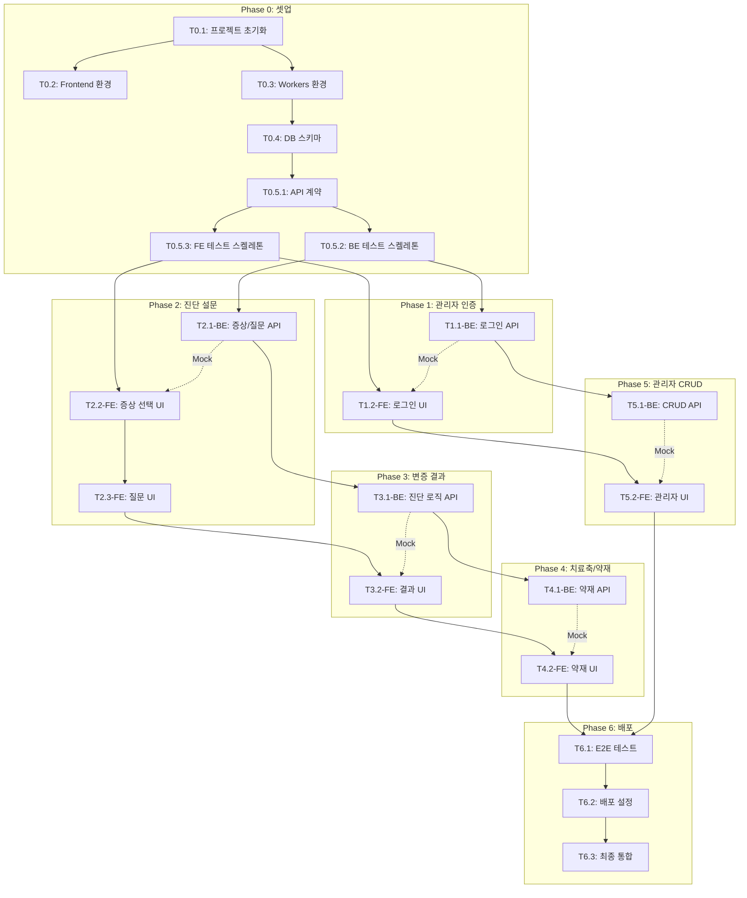

# TASKS: 한방진단 - AI 개발 파트너용 태스크 목록

> TDD 워크플로우, Git Worktree, Phase 규칙이 적용된 태스크 목록입니다.

---

## MVP 캡슐

| # | 항목 | 내용 |
|---|------|------|
| 1 | 목표 | 사용자 증상 입력 → 한의학적 변증 도출 → 치료법/약재 정보 제공 |
| 2 | 페르소나 | 건강에 관심 있는 30-50대 일반인 |
| 3 | 핵심 기능 | FEAT-1: 증상 진단 설문 → 변증 결과 → 치료축/약재 추천 |
| 4 | 성공 지표 (노스스타) | 진단 완료율 (설문 시작 → 결과 확인까지 완료한 비율) |
| 5 | 입력 지표 | 일일 진단 시작 수, 결과 페이지 체류 시간 |
| 6 | 비기능 요구 | 진단 결과 산출 3초 이내, 관리자 인증 보안 |
| 7 | Out-of-scope | 모바일 앱, 소셜 로그인, 결제 시스템 |
| 8 | Top 리스크 | 진단 로직/데이터가 클라이언트로부터 늦게 전달될 경우 |
| 9 | 완화/실험 | 샘플 데이터로 먼저 개발, 로직 인터페이스 추상화 |
| 10 | 다음 단계 | 샘플 질문/변증/약재 데이터로 프로토타입 구현 |

---

## 마일스톤 개요

| 마일스톤 | Phase | 설명 | 주요 산출물 |
|----------|-------|------|------------|
| M0 | Phase 0 | 프로젝트 셋업 | 프로젝트 구조, 의존성, 빌드 환경 |
| M0.5 | Phase 0 | 계약 & 테스트 정의 | API 계약, 테스트 스켈레톤 (RED 상태) |
| M1 | Phase 1 | FEAT-0 관리자 인증 | 로그인 API, 관리자 UI |
| M2 | Phase 2 | FEAT-1 진단 설문 | 증상/질문 API, 설문 UI |
| M3 | Phase 3 | FEAT-2 변증 결과 | 진단 로직, 결과 화면 |
| M4 | Phase 4 | FEAT-3 치료축/약재 | 약재 API, 추천 화면 |
| M5 | Phase 5 | FEAT-0 관리자 CRUD | 데이터 관리 UI |
| M6 | Phase 6 | 통합 및 배포 | E2E 테스트, Cloudflare 배포 |

---

## M0: 프로젝트 셋업

### [x] Phase 0, T0.1: 프로젝트 초기화

**담당**: frontend-specialist

**작업 내용**:
- pnpm 워크스페이스 설정 (루트 package.json)
- frontend/ 디렉토리 생성 (React + Vite + TypeScript)
- workers/ 디렉토리 생성 (Cloudflare Workers + Hono)
- contracts/ 디렉토리 생성 (공유 타입)
- Git 초기화 및 .gitignore 설정

**산출물**:
- `package.json` (루트)
- `pnpm-workspace.yaml`
- `frontend/package.json`
- `workers/package.json`
- `contracts/package.json`
- `.gitignore`

**완료 조건**:
- [ ] `pnpm install` 성공
- [ ] 각 워크스페이스 독립적으로 빌드 가능

---

### [x] Phase 0, T0.2: Frontend 개발 환경 설정

**담당**: frontend-specialist

**작업 내용**:
- Vite + React + TypeScript 설정
- TailwindCSS 설정 (Design System 기반)
- ESLint + Prettier 설정
- Vitest + React Testing Library 설정
- MSW (Mock Service Worker) 설정

**산출물**:
- `frontend/vite.config.ts`
- `frontend/tailwind.config.js`
- `frontend/tsconfig.json`
- `frontend/.eslintrc.js`
- `frontend/src/mocks/browser.ts`

**완료 조건**:
- [ ] `npm run dev` 로 개발 서버 실행
- [ ] `npm run build` 로 프로덕션 빌드
- [ ] `npm run test` 로 테스트 실행
- [ ] `npm run lint` 통과

---

### [x] Phase 0, T0.3: Workers 개발 환경 설정

**담당**: backend-specialist

**작업 내용**:
- Hono 프레임워크 설정
- Drizzle ORM + D1 설정
- Zod 스키마 검증 설정
- Vitest + Miniflare 테스트 환경 설정
- wrangler.toml 설정

**산출물**:
- `workers/src/index.ts` (Hono 앱 엔트리)
- `workers/wrangler.toml`
- `workers/drizzle.config.ts`
- `workers/vitest.config.ts`

**완료 조건**:
- [ ] `npm run dev` 로 로컬 Workers 실행
- [ ] `npm run test` 로 테스트 실행
- [ ] D1 바인딩 설정 완료

---

### [x] Phase 0, T0.4: 데이터베이스 스키마 및 마이그레이션

**담당**: database-specialist

**작업 내용**:
- Drizzle 스키마 정의 (Database Design 문서 기반)
- 초기 마이그레이션 생성
- 샘플 데이터 시드 스크립트 작성

**산출물**:
- `workers/src/db/schema.ts`
- `workers/src/db/migrations/0001_initial.sql`
- `workers/src/db/seed.ts`

**완료 조건**:
- [ ] 마이그레이션 실행 성공
- [ ] 샘플 데이터 삽입 성공
- [ ] 스키마 타입 자동 생성

---

## M0.5: 계약 & 테스트 정의 (Contract-First)

### [ ] Phase 0, T0.5.1: API 계약 정의

**담당**: backend-specialist

**작업 내용**:
- 공통 타입 정의 (ApiResponse, ApiError)
- 진단 API 계약 정의 (GET /symptoms, GET /questions, POST /diagnosis)
- 관리자 API 계약 정의 (POST /admin/login, CRUD APIs)
- Zod 스키마와 동기화

**산출물**:
- `contracts/types.ts`
- `contracts/diagnosis.contract.ts`
- `contracts/admin.contract.ts`
- `workers/src/schemas/diagnosis.ts`
- `workers/src/schemas/admin.ts`

**완료 조건**:
- [ ] 모든 API 엔드포인트 계약 정의됨
- [ ] Request/Response 타입 명확
- [ ] FE/BE 공유 가능한 구조

---

### [ ] Phase 0, T0.5.2: Backend 테스트 스켈레톤 (RED)

**담당**: test-specialist

**작업 내용**:
- 진단 API 테스트 작성 (실패 상태)
- 관리자 API 테스트 작성 (실패 상태)
- 테스트 유틸리티 설정

**산출물**:
- `workers/tests/diagnosis.test.ts`
- `workers/tests/admin.test.ts`
- `workers/tests/utils/testClient.ts`

**완료 조건**:
- [ ] 모든 테스트가 FAILED 상태 (RED)
- [ ] 테스트 커버리지 리포트 설정

---

### [ ] Phase 0, T0.5.3: Frontend MSW 핸들러 및 테스트 스켈레톤 (RED)

**담당**: test-specialist

**작업 내용**:
- MSW 핸들러 작성 (계약 기반)
- 컴포넌트 테스트 스켈레톤 작성 (실패 상태)
- Mock 데이터 정의

**산출물**:
- `frontend/src/mocks/handlers/diagnosis.ts`
- `frontend/src/mocks/handlers/admin.ts`
- `frontend/src/mocks/data/mockData.ts`
- `frontend/src/__tests__/pages/Diagnosis.test.tsx`

**완료 조건**:
- [ ] MSW 핸들러가 계약과 일치
- [ ] 컴포넌트 테스트가 FAILED 상태 (RED)

---

## M1: FEAT-0 관리자 인증

### [ ] Phase 1, T1.1-BE: 관리자 로그인 API RED→GREEN

**담당**: backend-specialist

**Git Worktree 설정**:
```bash
# 1. Worktree 생성
git worktree add ../med-herb-phase1-auth-be -b phase/1-auth-be
cd ../med-herb-phase1-auth-be

# 2. 작업 완료 후 (사용자 승인 필요)
# git checkout main && git merge --no-ff phase/1-auth-be
# git worktree remove ../med-herb-phase1-auth-be
```

**TDD 사이클**:

1. **RED**: 테스트 확인 (실패)
   ```bash
   # 테스트 파일: workers/tests/admin.test.ts
   cd workers && npm run test -- admin.test.ts -v
   # Expected: FAILED (POST /api/admin/login)
   ```

2. **GREEN**: 최소 구현
   ```bash
   # 구현 파일:
   # - workers/src/routes/admin.ts
   # - workers/src/services/authService.ts
   # - workers/src/middleware/auth.ts
   cd workers && npm run test -- admin.test.ts -v
   # Expected: PASSED
   ```

3. **REFACTOR**: 코드 정리
   - JWT 토큰 생성/검증 로직 분리
   - KV 세션 저장 로직 분리

**산출물**:
- `workers/src/routes/admin.ts` (POST /api/admin/login)
- `workers/src/services/authService.ts`
- `workers/src/middleware/auth.ts`

**인수 조건**:
- [ ] 테스트 먼저 확인됨 (RED)
- [ ] POST /api/admin/login 테스트 통과 (GREEN)
- [ ] JWT 토큰 정상 발급
- [ ] 잘못된 비밀번호 시 401 반환
- [ ] 커버리지 >= 80%

---

### [ ] Phase 1, T1.2-FE: 관리자 로그인 UI RED→GREEN

**담당**: frontend-specialist

**의존성**: T1.1-BE - **Mock 사용으로 독립 개발 가능**

**Git Worktree 설정**:
```bash
git worktree add ../med-herb-phase1-auth-fe -b phase/1-auth-fe
cd ../med-herb-phase1-auth-fe
```

**Mock 설정** (이미 T0.5.3에서 생성됨):
```typescript
// frontend/src/mocks/handlers/admin.ts
http.post('/api/admin/login', async ({ request }) => {
  const { username, password } = await request.json();
  if (username === 'admin' && password === 'password') {
    return HttpResponse.json({ success: true, data: { token: 'mock-jwt' } });
  }
  return HttpResponse.json({ success: false, error: { code: 'UNAUTHORIZED' } }, { status: 401 });
});
```

**TDD 사이클**:

1. **RED**: 테스트 확인
   ```bash
   cd frontend && npm run test -- AdminLogin.test.tsx -v
   # Expected: FAILED
   ```

2. **GREEN**: 최소 구현
   ```bash
   # 구현 파일:
   # - frontend/src/pages/admin/Login.tsx
   # - frontend/src/stores/adminStore.ts
   # - frontend/src/api/admin.ts
   cd frontend && npm run test -- AdminLogin.test.tsx -v
   # Expected: PASSED
   ```

**산출물**:
- `frontend/src/pages/admin/Login.tsx`
- `frontend/src/stores/adminStore.ts`
- `frontend/src/api/admin.ts`
- `frontend/src/__tests__/pages/admin/AdminLogin.test.tsx`

**인수 조건**:
- [ ] 테스트 먼저 확인됨 (RED)
- [ ] 로그인 폼 렌더링 테스트 통과
- [ ] 로그인 성공 시 대시보드 이동
- [ ] 로그인 실패 시 에러 표시
- [ ] 커버리지 >= 80%

---

## M2: FEAT-1 진단 설문

### [ ] Phase 2, T2.1-BE: 증상/질문 목록 API RED→GREEN

**담당**: backend-specialist

**Git Worktree 설정**:
```bash
git worktree add ../med-herb-phase2-diagnosis-be -b phase/2-diagnosis-be
cd ../med-herb-phase2-diagnosis-be
```

**TDD 사이클**:

1. **RED**: 테스트 확인
   ```bash
   cd workers && npm run test -- diagnosis.test.ts -v
   # Expected: FAILED (GET /api/symptoms, GET /api/questions)
   ```

2. **GREEN**: 최소 구현
   ```bash
   # 구현 파일:
   # - workers/src/routes/diagnosis.ts
   # - workers/src/services/diagnosisService.ts
   cd workers && npm run test -- diagnosis.test.ts -v
   # Expected: PASSED
   ```

**산출물**:
- `workers/src/routes/diagnosis.ts` (GET /api/symptoms, GET /api/questions)
- `workers/src/services/diagnosisService.ts`

**인수 조건**:
- [ ] GET /api/symptoms 활성 증상 목록 반환
- [ ] GET /api/questions 활성 질문 목록 반환 (display_order 정렬)
- [ ] 커버리지 >= 80%

---

### [ ] Phase 2, T2.2-FE: 증상 선택 UI RED→GREEN

**담당**: frontend-specialist

**의존성**: T2.1-BE - **Mock 사용으로 독립 개발 가능**

**Git Worktree 설정**:
```bash
git worktree add ../med-herb-phase2-symptom-fe -b phase/2-symptom-fe
cd ../med-herb-phase2-symptom-fe
```

**TDD 사이클**:

1. **RED**: 테스트 확인
   ```bash
   cd frontend && npm run test -- SymptomSelector.test.tsx -v
   # Expected: FAILED
   ```

2. **GREEN**: 최소 구현
   ```bash
   # 구현 파일:
   # - frontend/src/components/diagnosis/SymptomSelector.tsx
   # - frontend/src/pages/Diagnosis.tsx
   # - frontend/src/hooks/useDiagnosis.ts
   cd frontend && npm run test -- SymptomSelector.test.tsx -v
   # Expected: PASSED
   ```

**산출물**:
- `frontend/src/components/diagnosis/SymptomSelector.tsx`
- `frontend/src/pages/Diagnosis.tsx`
- `frontend/src/hooks/useDiagnosis.ts`
- `frontend/src/stores/diagnosisStore.ts`

**인수 조건**:
- [ ] 증상 목록 로딩 및 표시
- [ ] 체크박스 선택/해제
- [ ] 최소 1개 선택 시 "다음" 버튼 활성화
- [ ] 진행률 표시 (1/3)
- [ ] 커버리지 >= 80%

---

### [ ] Phase 2, T2.3-FE: 상황 질문 UI RED→GREEN

**담당**: frontend-specialist

**의존성**: T2.2-FE

**Git Worktree 설정**:
```bash
git worktree add ../med-herb-phase2-question-fe -b phase/2-question-fe
cd ../med-herb-phase2-question-fe
```

**TDD 사이클**:

1. **RED**: 테스트 확인
   ```bash
   cd frontend && npm run test -- QuestionCard.test.tsx -v
   # Expected: FAILED
   ```

2. **GREEN**: 최소 구현

**산출물**:
- `frontend/src/components/diagnosis/QuestionCard.tsx`
- `frontend/src/components/diagnosis/RadioOptions.tsx`
- `frontend/src/components/diagnosis/SliderInput.tsx`

**인수 조건**:
- [ ] 질문 텍스트 표시
- [ ] radio 타입: 단일 선택 옵션
- [ ] slider 타입: 수치 선택 바
- [ ] 진행률 표시 (Q1/10 형태)
- [ ] 이전/다음 버튼
- [ ] 커버리지 >= 80%

---

## M3: FEAT-2 변증 결과

### [ ] Phase 3, T3.1-BE: 진단 로직 API RED→GREEN

**담당**: backend-specialist

**Git Worktree 설정**:
```bash
git worktree add ../med-herb-phase3-result-be -b phase/3-result-be
cd ../med-herb-phase3-result-be
```

**TDD 사이클**:

1. **RED**: 테스트 확인
   ```bash
   cd workers && npm run test -- diagnosis.test.ts -v
   # Expected: FAILED (POST /api/diagnosis)
   ```

2. **GREEN**: 최소 구현
   ```bash
   # 구현 파일:
   # - workers/src/services/diagnosisEngine.ts (진단 로직)
   # - workers/src/routes/diagnosis.ts (POST /api/diagnosis)
   ```

**산출물**:
- `workers/src/services/diagnosisEngine.ts`
- `workers/src/routes/diagnosis.ts` (POST /api/diagnosis 추가)

**인수 조건**:
- [ ] POST /api/diagnosis 요청 처리
- [ ] 증상 + 응답 기반 변증 후보 3개 반환
- [ ] 각 변증에 근거 bullet 포함
- [ ] 진단 로그 저장 (DIAGNOSIS_LOG)
- [ ] 응답 시간 < 3초
- [ ] 커버리지 >= 80%

---

### [ ] Phase 3, T3.2-FE: 변증 결과 UI RED→GREEN

**담당**: frontend-specialist

**의존성**: T3.1-BE - **Mock 사용으로 독립 개발 가능**

**Git Worktree 설정**:
```bash
git worktree add ../med-herb-phase3-result-fe -b phase/3-result-fe
cd ../med-herb-phase3-result-fe
```

**TDD 사이클**:

1. **RED**: 테스트 확인
   ```bash
   cd frontend && npm run test -- SyndromeCard.test.tsx -v
   # Expected: FAILED
   ```

2. **GREEN**: 최소 구현

**산출물**:
- `frontend/src/pages/Result.tsx`
- `frontend/src/components/diagnosis/SyndromeCard.tsx`
- `frontend/src/components/diagnosis/EvidenceModal.tsx`

**인수 조건**:
- [ ] 변증 후보 카드 3개 표시
- [ ] 카드 클릭 시 상세 근거 모달
- [ ] "치료법 보기" 버튼
- [ ] 로딩 상태 표시
- [ ] 커버리지 >= 80%

---

## M4: FEAT-3 치료축/약재

### [ ] Phase 4, T4.1-BE: 치료축/약재 API RED→GREEN

**담당**: backend-specialist

**Git Worktree 설정**:
```bash
git worktree add ../med-herb-phase4-herb-be -b phase/4-herb-be
cd ../med-herb-phase4-herb-be
```

**TDD 사이클**:

1. **RED**: POST /api/diagnosis 응답에 치료축/약재 포함 테스트
2. **GREEN**: 구현

**산출물**:
- `workers/src/services/herbService.ts`
- 진단 응답에 `treatmentAxes`, `herbs` 필드 추가

**인수 조건**:
- [ ] 변증 기반 치료축 3개 반환
- [ ] 공통 약재 5개 반환 (우선순위 기반)
- [ ] 각 약재에 근거 URL 포함
- [ ] 커버리지 >= 80%

---

### [ ] Phase 4, T4.2-FE: 치료축/약재 UI RED→GREEN

**담당**: frontend-specialist

**의존성**: T4.1-BE - **Mock 사용으로 독립 개발 가능**

**Git Worktree 설정**:
```bash
git worktree add ../med-herb-phase4-herb-fe -b phase/4-herb-fe
cd ../med-herb-phase4-herb-fe
```

**TDD 사이클**:

1. **RED**: 테스트 확인
   ```bash
   cd frontend && npm run test -- HerbTable.test.tsx -v
   # Expected: FAILED
   ```

2. **GREEN**: 최소 구현

**산출물**:
- `frontend/src/pages/Treatment.tsx`
- `frontend/src/components/diagnosis/TreatmentAxisCard.tsx`
- `frontend/src/components/diagnosis/HerbTable.tsx`

**인수 조건**:
- [ ] 치료축 3개 카드 표시
- [ ] 약재 테이블 (이름, 효능, 근거 링크)
- [ ] 근거 링크 클릭 시 새 탭 열기
- [ ] "다시 진단" 버튼
- [ ] 커버리지 >= 80%

---

## M5: FEAT-0 관리자 CRUD

### [ ] Phase 5, T5.1-BE: 관리자 CRUD API RED→GREEN

**담당**: backend-specialist

**Git Worktree 설정**:
```bash
git worktree add ../med-herb-phase5-admin-be -b phase/5-admin-be
cd ../med-herb-phase5-admin-be
```

**TDD 사이클**:

1. **RED**: 테스트 확인
   ```bash
   cd workers && npm run test -- admin.test.ts -v
   # Expected: FAILED (CRUD endpoints)
   ```

2. **GREEN**: 최소 구현

**산출물**:
- `workers/src/routes/admin.ts` (CRUD 엔드포인트 추가)
  - `/api/admin/symptoms` (GET, POST, PUT, DELETE)
  - `/api/admin/questions` (GET, POST, PUT, DELETE)
  - `/api/admin/syndromes` (GET, POST, PUT, DELETE)
  - `/api/admin/herbs` (GET, POST, PUT, DELETE)
- `workers/src/services/adminService.ts`

**인수 조건**:
- [ ] JWT 인증 미들웨어 적용
- [ ] 각 리소스 CRUD 동작
- [ ] 유효성 검증 (Zod)
- [ ] 커버리지 >= 80%

---

### [ ] Phase 5, T5.2-FE: 관리자 대시보드 UI RED→GREEN

**담당**: frontend-specialist

**의존성**: T5.1-BE - **Mock 사용으로 독립 개발 가능**

**Git Worktree 설정**:
```bash
git worktree add ../med-herb-phase5-admin-fe -b phase/5-admin-fe
cd ../med-herb-phase5-admin-fe
```

**산출물**:
- `frontend/src/pages/admin/Dashboard.tsx`
- `frontend/src/pages/admin/SymptomManage.tsx`
- `frontend/src/pages/admin/QuestionManage.tsx`
- `frontend/src/pages/admin/SyndromeManage.tsx`
- `frontend/src/pages/admin/HerbManage.tsx`
- `frontend/src/components/admin/DataTable.tsx`
- `frontend/src/components/admin/AdminNav.tsx`

**인수 조건**:
- [ ] 로그인 상태 확인 (미로그인 시 로그인 페이지로)
- [ ] 사이드 네비게이션
- [ ] 각 데이터 목록 테이블
- [ ] 추가/수정/삭제 모달
- [ ] 커버리지 >= 80%

---

## M6: 통합 및 배포

### [ ] Phase 6, T6.1: E2E 테스트 작성

**담당**: test-specialist

**Git Worktree 설정**:
```bash
git worktree add ../med-herb-phase6-e2e -b phase/6-e2e
cd ../med-herb-phase6-e2e
```

**작업 내용**:
- Playwright E2E 테스트 작성
- 핵심 사용자 시나리오 테스트

**산출물**:
- `frontend/e2e/diagnosis-flow.spec.ts`
- `frontend/e2e/admin-flow.spec.ts`

**인수 조건**:
- [ ] 진단 완료 플로우 E2E 통과
- [ ] 관리자 로그인 → CRUD E2E 통과

---

### [ ] Phase 6, T6.2: Cloudflare 배포 설정

**담당**: frontend-specialist

**작업 내용**:
- Cloudflare Pages 설정
- Workers 배포 설정
- D1 프로덕션 데이터베이스 생성
- 환경 변수 설정

**산출물**:
- `.github/workflows/deploy.yml`
- Cloudflare Dashboard 설정 완료

**인수 조건**:
- [ ] main 브랜치 push 시 자동 배포
- [ ] 프로덕션 D1에 스키마 적용
- [ ] 환경 변수 (JWT_SECRET 등) 설정
- [ ] HTTPS 동작 확인

---

### [ ] Phase 6, T6.3: 최종 통합 테스트

**담당**: test-specialist

**작업 내용**:
- Mock 제거 후 실제 API 연동
- 전체 E2E 테스트 실행
- 성능 테스트 (진단 < 3초)

**인수 조건**:
- [ ] 모든 E2E 테스트 통과
- [ ] 진단 응답 시간 < 3초
- [ ] Lighthouse 점수 확인 (FCP < 2초)

---

## 의존성 그래프



---

## 병렬 실행 가능 태스크

| Phase | 병렬 가능 태스크 | 조건 |
|-------|-----------------|------|
| Phase 0 | T0.2, T0.3 | T0.1 완료 후 |
| Phase 0 | T0.5.2, T0.5.3 | T0.5.1 완료 후 |
| Phase 1 | T1.1-BE, T1.2-FE | Mock 사용 시 |
| Phase 2 | T2.1-BE, T2.2-FE | Mock 사용 시 |
| Phase 3 | T3.1-BE, T3.2-FE | Mock 사용 시 |
| Phase 4 | T4.1-BE, T4.2-FE | Mock 사용 시 |
| Phase 5 | T5.1-BE, T5.2-FE | Mock 사용 시 |

---

## 완료 체크리스트

### Phase 0 완료 조건
- [ ] 모든 워크스페이스 빌드/테스트 가능
- [ ] DB 스키마 및 샘플 데이터 적용
- [ ] API 계약 정의 완료
- [ ] 모든 테스트가 RED 상태

### Phase 1-5 완료 조건
- [ ] 해당 Phase의 모든 테스트 GREEN
- [ ] 커버리지 >= 80%
- [ ] 린트/타입 체크 통과
- [ ] 사용자 승인 후 main 병합

### Phase 6 완료 조건
- [ ] 모든 E2E 테스트 통과
- [ ] Cloudflare 배포 성공
- [ ] 진단 응답 < 3초
- [ ] 프로덕션 환경 동작 확인
